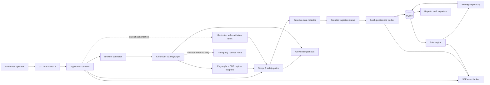

# Web Security Observatory — Master Implementation Plan

**Status:** Approved — implementation may proceed by work unit  
**Document version:** 1.0  
**Target runtime:** Python 3.12+  
**Default operating mode:** Passive observation only  

This document is the implementation contract for an authorized-use Web Security Observatory. No implementation work unit begins until this plan is approved. After approval, architecture-affecting changes require an explicit Architecture Decision Record (ADR) and renewed approval; implementation details that preserve the boundaries and interfaces below may evolve within a work unit.

## 1. Problem statement

Security teams need to understand the real browser/API behavior of web applications they own or are explicitly authorized to assess. Existing proxy logs often lose the user's intent, browser context, WebSocket activity, and evidence needed to distinguish a weak signal from a verified issue.

The product will launch Chromium through Playwright, observe authorized user journeys, correlate browser actions with network activity, persist bounded and redacted evidence, run conservative passive security rules, and produce actionable reports. Optional active validation is a separately authorized, tightly rate-limited, non-mutating capability. The system is an observatory, not an exploitation framework.

### Success principles

- Safety and scope enforcement precede capture, persistence, analysis, export, and validation.
- Secrets are redacted before crossing the capture boundary into queues, logs, storage, events, or reports.
- Findings express evidence, confidence, uncertainty, false-positive conditions, and remediation.
- Browser control, capture, analysis, persistence, application services, API/CLI, and UI remain independently testable.
- The MVP is operational code, not a skeleton, and meets the acceptance criteria in section 20.

## 2. Authorized-use boundary

The tool is only for targets owned by the operator or covered by explicit authorization. Every project requires a canonical `base_url`, non-empty `allowed_hosts`, optional `denied_hosts`, and acknowledgement of authorization. A denied host always wins over an allowed host.

The default is `passive_only: true` and `active_validation.enabled: false`. Passive mode observes traffic generated by the user's normal browser activity; it does not synthesize probes. Active validation requires all of:

- `enabled: true` and `authorized: true` in validated configuration;
- an in-scope destination after DNS/URL/redirect checks;
- an allowlisted method (`GET`, `HEAD`, or `OPTIONS` by default);
- per-rule request budgets, a global rate limit, delay, timeout, body limit, and audit event;
- a rule whose validator is explicitly registered as safe and non-mutating.

The product will not implement brute force, credential stuffing, password spraying, authentication/MFA bypass, signature forgery, privilege escalation, persistence, destructive requests, unrestricted fuzzing, injection exploitation, malicious uploads, metadata-service SSRF, stored XSS payload delivery, payment manipulation, real-user IDOR probing, session hijacking, denial of service, or arbitrary WebSocket frame injection. Signals requiring invasive confirmation are reported with safe manual verification guidance for an isolated staging environment.

## 3. Use cases

1. An analyst creates a scoped project, opens headed Chromium, performs a login and normal workflow, and receives redacted findings tied to the relevant actions and transactions.
2. CI runs a known, non-destructive headless journey against a local or explicitly authorized staging host and generates machine-readable JSON plus HTML.
3. An analyst inspects live Fetch/XHR/document/WebSocket traffic and filters it by action, endpoint, host, resource type, or finding.
4. A reviewer imports an existing SQLite session, reruns the current passive rule set deterministically, triages findings, and exports redacted HTML, Markdown, JSON, or HAR.
5. An authorized operator explicitly enables a small set of safe GET/HEAD/OPTIONS validations and receives an auditable validation result.
6. Developers run the bundled local demo application to exercise capture, rules, reports, and security invariants without contacting a real target.

## 4. Non-goals

- Automated exploitation or proof-of-compromise.
- Full replacement for a DAST scanner, intercepting proxy, SAST/SCA tool, WAF, SIEM, or manual penetration test.
- Decrypting traffic outside the controlled Chromium context or installing a system-wide interception CA.
- Discovering hidden assets by crawling, wordlists, brute force, or mutation in passive mode.
- Proving authorization defects from identifiers alone.
- Cracking, re-signing, or tampering with JWTs.
- Long-term secret storage, credential management, or production traffic surveillance.
- Claiming complete visibility into browser, service-worker, native-client, encrypted application payload, or server-side behavior.

## 5. Threat model

### Assets

- Authentication material, cookies, tokens, request/response bodies, PII, test credentials, browser profiles, storage state, captured evidence, findings, and analyst notes.
- Scope/authorization policy, validation budgets, rule configuration, session database, exports, and audit logs.
- Availability and integrity of the target application and the operator workstation.

### Trust boundaries

1. Operator/configuration → application service.
2. Untrusted web content → Playwright/CDP capture process.
3. Capture process → bounded redaction/ingestion queue.
4. Queue → SQLite repository.
5. Stored observations → analysis plugins.
6. Backend → browser UI/API/SSE clients.
7. Safe validation client → network and target.
8. Observatory → exported artifacts and filesystem.

### Primary threats and controls

| Threat | Control |
|---|---|
| Accidental out-of-scope testing | Canonical URL/host policy at project creation, navigation, ingestion, analysis, validation, redirects, and DNS rebinding checks |
| Secrets persisted or emitted | Redact before queue/storage/log/event; defensive re-redaction at rendering/export; secret-safe exceptions |
| Malicious page overwhelms memory/disk | Body/frame caps, bounded queues, batching, timeouts, truncation metadata, retention quotas, backpressure |
| Rule plugin mutates target or browser | Rules consume immutable transaction views; only registered validators receive a restricted safe client |
| SSRF through URL/config/API | Scheme/port policy, host canonicalization, resolved-IP policy, redirect revalidation, no arbitrary URL fetch endpoint |
| Stored HTML/script executes in report/UI | Context-aware escaping, CSP, no unsafe HTML rendering, download-safe content disposition |
| SQLite/API unauthorized local exposure | Loopback binding by default, filesystem permissions, optional API auth, no CORS wildcard with credentials |
| Browser profile/storage-state leakage | Opt-in persistence, protected artifact directory, clear warnings, retention/deletion workflow, never embed in reports |
| Sensitive logs and tracebacks | Structured allowlisted log fields; redacted error contexts; debug disabled by default |
| Active-validation configuration abuse | Dual opt-in, method allowlist, immutable budgets, audit log, per-host limiter, kill switch |
| Supply-chain compromise | Locked dependencies, hashes where practical, dependency review/scanning, minimal container, reproducible CI |
| Symlink/path traversal in artifacts | Session-owned generated paths, resolved-path containment checks, sanitized filenames |

Threat actors include an accidental operator, a malicious/compromised target page, an unauthorized local API client, a malicious rule/plugin, and a person obtaining exported artifacts. The architecture does not assume target content is trustworthy.

## 6. Architecture diagram



### Dependency direction

`domain` has no framework dependencies. `capture`, `analysis`, `storage`, and `reporting` depend on domain contracts. Application services orchestrate ports. API, CLI, and UI depend on application services. Playwright models never enter storage interfaces; ORM entities never enter capture interfaces. Cross-layer communication uses typed domain DTOs and protocols.

## 7. Module responsibilities

Proposed package root: `websec_observer/` (distribution name `web-security-observer`, CLI `websec`).

| Module | Responsibility | Explicit exclusions |
|---|---|---|
| `domain/models` | Immutable entities/value objects for projects, sessions, actions, transactions, WebSockets, findings | Playwright, ORM, HTTP framework |
| `domain/enums` | Status, severity, confidence, resource/action types, finding disposition | Business orchestration |
| `domain/policies` | Scope, capture limits, active-validation policy contracts | Network I/O |
| `config` | Pydantic settings, YAML/env loading, cross-field validation | Secrets in defaults/source |
| `common/redaction` | Recursive, content-aware sensitive-data redaction and optional keyed fingerprinting | Security findings |
| `common/logging` | Structured safe logging and correlation IDs | Raw request/response data |
| `capture/browser_controller.py` | Browser/context lifecycle, headed/headless, profiles, state, proxy, video, trace, shutdown | Vulnerability decisions |
| `capture/network_listener.py` | Request/response/timing/redirect/download capture and body bounds | Finding generation |
| `capture/websocket_listener.py` | Handshake, connection, frames, close/reconnect observations | Sending arbitrary frames |
| `capture/action_tracker.py` | DOM event instrumentation, SPA navigation, action correlation | Credential capture |
| `capture/cdp_adapter.py` | CDP-only metadata and protocol normalization | Direct persistence |
| `capture/ingestion.py` | Redact, scope-filter, queue, batch, backpressure/drop metrics | Rule evaluation |
| `analysis/analyzer.py` | Session/transaction analysis orchestration | Browser control |
| `analysis/rule_engine.py` | Plugin registry, enablement, deterministic execution, isolation | Dynamic untrusted plugin install |
| `analysis/evidence.py` | Bounded redacted evidence builders | Raw secret retention |
| `analysis/severity.py` | Severity/confidence policy and contextual adjustments | Rule-specific parsing |
| `analysis/rules/*` | One concern per passive rule family | Network/browser mutation |
| `analysis/validation` | Restricted client, budgets, audit, validation results | Unsafe methods/probes |
| `storage/repositories` | Async repository protocols/unit of work | Playwright types |
| `storage/sqlite` | SQLAlchemy async mappings, queries, batching, migrations | Analysis logic |
| `reporting` | HTML/JSON/Markdown/HAR presenters and safe templates | Fetching target data |
| `api` | FastAPI schemas/routes, SSE, validation/error mapping | Playwright calls from routes |
| `cli` | Typer commands invoking application services | Layer bypass |
| `ui` | Dashboard/viewers/triage/scope screens through API | Direct Playwright access |
| `demo` | Local-only deliberately weak test application | External target access |

## 8. Data model

All identifiers are UUIDs represented consistently; timestamps are timezone-aware UTC. JSON fields use canonical JSON text in SQLite. Large bounded bodies may be stored as compressed blobs with encoding metadata. Redacted values only are persisted.

### Core entities

- **TestProject:** `id`, `name`, `base_url`, `allowed_hosts`, `denied_hosts`, `passive_only`, `active_validation_config`, `created_at`.
- **TestSession:** `id`, `project_id`, `started_at`, `ended_at`, `browser_version`, `user_agent`, `status`, `config_snapshot`, capture/drop counters.
- **UserAction:** `id`, `session_id`, `action_type`, `page_url`, `selector`, `description`, `timestamp`, `correlation_start`, `correlation_end`. Input values are never captured; selectors/descriptions are redacted and bounded.
- **NetworkRequest:** `id`, `session_id`, nullable `action_id`, browser `request_id`, `timestamp`, `resource_type`, `method`, `url`, `scheme`, `host`, nullable `port`, `path`, `query`, `headers`, `cookies`, nullable `body`, `body_encoding`, `initiator`, nullable `redirect_from_id`, `size`, `scope_disposition`, `truncated`, `body_sha256`.
- **NetworkResponse:** one-to-one `request_id`, `timestamp`, `status`, `status_text`, `headers`, `cookies`, `content_type`, nullable `body`, `body_encoding`, `size`, `duration_ms`, nullable `remote_ip`, `protocol`, `from_cache`, `truncated`, `decode_error`.
- **WebSocketConnection:** `id`, `session_id`, nullable `action_id`, `url`, redacted handshake request/response metadata, `origin`, `subprotocol`, `opened_at`, nullable `closed_at`, `scope_disposition`.
- **WebSocketFrame:** `id`, `connection_id`, `direction`, `timestamp`, `opcode`, nullable bounded `payload`, `payload_encoding`, `size`, `truncated`.
- **Finding:** `id`, `session_id`, `rule_id`, `rule_version`, `title`, `category`, `severity`, `confidence`, `affected_url`, nullable `affected_request_id`, `description`, `evidence`, `remediation`, `references`, `false_positive_notes`, `safe_reproduction`, `status`, nullable `analyst_note`, `fingerprint`, `created_at`, `updated_at`.
- **ValidationAudit:** `id`, `session_id`, `finding_id`, `rule_id`, method, redacted URL, scope decision, budget counters, started/ended timestamps, result, and failure reason.

### Relationships and indexes

- Project 1—N sessions; session 1—N actions, requests, WebSockets, findings, and validation audits.
- Request 1—0..1 response; action 1—N correlated requests; connection 1—N frames.
- Unique: `(session_id, browser_request_id)` and finding fingerprint per analysis run policy.
- Indexes: request `(session_id, timestamp)`, `(session_id, host, path)`, `(session_id, resource_type)`, `(action_id)`; response `(status)` via joined query strategy; action `(session_id, timestamp)`; finding `(session_id, severity)`, `(session_id, category)`, `(session_id, status)`; frame `(connection_id, timestamp)`.
- A schema revision table is managed with Alembic migrations. Foreign keys are enabled. Repository tests verify migrations from an empty database.

## 9. Capture lifecycle

1. Validate project authorization, canonical scope, capture settings, artifact paths, and active-mode invariants.
2. Create session with an immutable, secret-free configuration snapshot and `STARTING` status.
3. Launch Chromium/context; attach Playwright listeners before navigation and CDP listeners where Playwright lacks timing/protocol detail.
4. Install action instrumentation using isolated bindings. Record action type/metadata, never input field values. Detect SPA history changes, navigation, popups, frames, downloads, and important keyboard actions.
5. For each event, canonicalize URL and evaluate scope before reading bodies. Denied/out-of-scope traffic receives only configurable minimal metadata (timestamp, resource type, redacted origin host, disposition); it is never analyzed.
6. Read only supported bodies within compressed and decompressed size limits. Mark unavailable, binary, compressed, decode-error, or truncated states without blocking the event loop.
7. Redact the event, place it on a bounded async queue, and apply backpressure policy. High-value metadata is prioritized; oversized bodies/frames are dropped before transaction metadata. Every drop is counted and reported.
8. Persistence workers batch commits on size/time thresholds. Event notifications carry IDs and redacted summaries, not raw bodies.
9. Correlate requests to the nearest eligible action within the configurable window (default −2s/+8s), preferring same page/frame and causality metadata. Preserve nullable/unassigned state rather than forcing correlation.
10. On stop/signal/error, stop new intake, drain with a deadline, flush batches, close context/browser, finalize artifacts/counters, and set `COMPLETED`, `FAILED`, or `PARTIAL` accurately.

Redirect hops are separate requests linked by `redirect_from_id`; every hop is scope evaluated. TLS errors are logged as sanitized capture events. Service-worker visibility is recorded as a limitation when complete attribution is unavailable.

## 10. Analysis lifecycle

1. Load a stable snapshot of in-scope, redacted transactions and session context.
2. Resolve enabled rule IDs and versions from the registry; reject unknown or duplicate IDs.
3. Build immutable typed transaction views with bounded evidence access.
4. Execute applicable passive rules independently; a rule failure is isolated, logged safely, and recorded in analysis diagnostics.
5. Normalize severity/confidence through central policy. Header/field-name signals alone cannot be `Confirmed`.
6. Construct bounded evidence containing location, redacted preview, transaction IDs, rationale, false-positive notes, remediation, references, and safe reproduction guidance.
7. Fingerprint and deduplicate equivalent findings while preserving affected transaction counts/examples.
8. Persist findings transactionally and publish redacted finding events.
9. If explicitly requested and authorized, eligible findings may enter the separate validation lifecycle; passive analysis never invokes validation automatically.

Reanalysis records rule versions and replaces or versions generated findings without overwriting analyst triage fields.

## 11. Scope-enforcement design

### Canonicalization and matching

- Accept `http`/`https` for pages and `ws`/`wss` for observed sockets; active validation defaults to `https` except explicit local demo allowances.
- Parse with a standards-based URL parser; lowercase IDNA-normalized hostnames, remove a terminal dot, normalize default ports, and reject user-info, malformed hosts, ambiguous numeric IP forms, and unsupported schemes.
- Host matching is exact by default. Subdomains require an explicit pattern such as `*.example.com`; the apex is not implied. Patterns are validated and never matched by string suffix alone.
- `denied_hosts` overrides allowed patterns and base host. URL fragments are not sent or stored as request components.
- Active validation resolves DNS, rejects disallowed/private/link-local/loopback/reserved addresses unless explicitly permitted for the local demo, connects using the validated destination, rechecks each redirect, and limits redirect count. DNS rebinding protections pin/revalidate the resolved set.

### Enforcement points

The same `ScopePolicy` is called by configuration validation, initial navigation, capture ingestion, body retrieval, WebSocket recording, analysis query filters, exporters, and the safe validation transport. It returns `ALLOW_FULL`, `ALLOW_METADATA_ONLY`, or `DENY`. Out-of-scope bodies, headers, query strings, cookies, and frames are never persisted. The UI visibly counts and warns about third-party traffic without exposing sensitive metadata.

The browser may naturally request third-party resources during passive observation; the observatory neither initiates additional requests to them nor analyzes them. In active mode, off-scope redirects are aborted and audited.

## 12. Redaction design

`SensitiveDataRedactor` is a standalone, deterministic service applied before queueing/persistence and again at output as defense in depth.

### Covered locations and formats

- Case-insensitive header names including `Authorization`, `Proxy-Authorization`, `Cookie`, `Set-Cookie`, and `X-API-Key`.
- Query/form/JSON/XML-like keys including access/refresh/ID tokens, password/passwd, secret/client_secret, card number, CVV, OTP, session, private key, and configurable additions.
- Cookie values, bearer/basic credentials, JWT-like values, private-key blocks, URL credentials, and sensitive WebSocket fields.
- Nested mappings/lists with recursion, field-count, string-length, and parse-size limits.
- Text previews use conservative pattern detection; binary data is not decoded speculatively.

Values become `[REDACTED]`. An optional keyed HMAC fingerprint (`[REDACTED:sha256:<short-id>]`) permits equality checks without enabling offline recovery; the key is supplied at runtime and is never stored with artifacts. Plain SHA-256 is not used for low-entropy secrets.

Whitelisting is local-debug-only, field-specific, rejected in production mode, prominently audited, and never permits core credential headers/password/card/CVV/private-key values. Redaction does not mutate the original browser request. Tests cover casing, nesting, encoding, malformed bodies, duplicates, substring false positives, logs, reports, HAR, events, and exceptions.

## 13. Rule-engine design

Rules implement a typed protocol conceptually equivalent to:

```python
class Rule(Protocol):
    rule_id: str
    title: str
    category: FindingCategory
    default_severity: Severity
    version: str

    def analyze(
        self, transaction: TransactionView, context: AnalysisContext
    ) -> Sequence[FindingDraft]: ...

    async def validate(
        self, finding: FindingView, client: SafeValidationClient
    ) -> ValidationResult: ...
```

`analyze` is pure, deterministic, and performs no I/O. A rule declares applicable resource/content types and required observations. Plugins are loaded from an internal allowlisted registry/entry points configured at startup; arbitrary uploaded code is unsupported. Findings are schema-validated, evidence-bounded, re-redacted, and severity-normalized before persistence.

`SafeValidationClient` exposes only policy-approved request methods and immutable controls; it does not expose Playwright, sockets, arbitrary redirects, raw credentials, or budget overrides. Each request requires a rule/finding context and creates an audit record. Validators are absent or return `NOT_SUPPORTED` unless specifically implemented and approved.

## 14. Passive checks

Initial rule families and conservative behavior:

| Family | Observations | Guardrail |
|---|---|---|
| Transport security | HTTP APIs, mixed content, downgrade redirects, missing HSTS, TLS errors, sensitive content over insecure transport | Missing HSTS is contextual; local HTTP demo is labeled local |
| Security headers | HSTS, CSP, nosniff, referrer/permissions policies, COOP/CORP/COEP, frame protections | Missing headers are not Critical without demonstrated impact |
| Cookie security | Secure, HttpOnly, SameSite, broad Domain/Path, suspicious lifetime/content | Parse attributes without retaining raw value |
| CORS | Wildcards, credentials conflict, observed origin reflection, broad methods/headers, odd preflight | No malicious Origin is sent in passive mode |
| CSRF signals | State-changing method, cookie auth, observed token/custom header, SameSite, Origin/Referer | Absence is a review signal, not proof of CSRF |
| Authentication | Token in URL/off-scope observation, configured storage snapshot, JWT metadata/expiry, login/logout/session-rotation signals | JWT is decoded only as untrusted metadata; no cracking or forgery |
| Authorization signals | Sequential IDs, multi-user-shaped responses, client-controlled identity/role/tenant fields, exposed admin endpoints | Title includes “Potential authorization review required”; no ID mutation |
| Sensitive exposure | Secret/PII/payment/cloud/internal/error patterns in permitted locations | Store type, location, and redacted bounded preview only |
| Error disclosure | Stack/SQL/framework debug/internal path/IP/source/config/version indicators | Framework/version alone generally low confidence |
| Cache control | Sensitive response with public caching or missing `no-store`; observed weak variation | Do not assert cross-user cache leakage without evidence |
| API design | Mass-assignment-shaped fields, excessive response, old/debug/docs/admin endpoints, GraphQL introspection/errors, auth inconsistency | Signals only; no dangerous fields or introspection query sent |
| Rate-limit signals | Headers, observed 429/Retry-After, sensitive endpoints lacking visible signals | No request spam; lack of header is not proof of no enforcement |
| WebSocket security | `ws://`, token in URL, sensitive frames, weak-origin/error/authz signals | No arbitrary frames in passive mode |

Severity uses Informational/Low/Medium/High/Critical and confidence uses Low/Medium/High/Confirmed. Directly observed token-in-URL can be High/Confirmed; potential IDOR remains High impact with Low/Medium confidence until safely verified outside passive mode.

## 15. Safe active-validation boundaries

Active validation is disabled by default and cannot be enabled through a UI toggle alone without valid persisted authorization configuration. Default policy:

```yaml
active_validation:
  enabled: false
  authorized: false
  max_requests_per_rule: 3
  delay_ms: 1000
  allowed_methods: [GET, OPTIONS, HEAD]
```

Allowed validator categories are limited to safe header/redirect observation, OPTIONS-based CORS checks, public-endpoint confirmation, and explicitly configured comparison of authenticated/unauthenticated test-account responses. Credentials must come from runtime secret injection or supplied browser states, never configuration committed to source or findings.

Controls include per-rule/per-session/per-host budgets, one concurrency slot per host by default, monotonic delays, timeout, maximum response bytes, redirect cap, content-type restrictions, cancellation, immutable audit logging, and a global kill switch. Mutating methods and method overrides are rejected. A GET endpoint known or indicated to mutate state is not validated. No validator follows form actions, executes returned scripts, retries authentication, sends arbitrary payloads, or contacts newly discovered hosts.

## 16. Reporting design

Report generation reads stored redacted data through reporting DTOs and re-runs redaction/escaping. Formats:

- **HTML:** self-contained, offline-safe report with strict CSP, no remote assets/scripts, executive summary, scope, time/browser, totals, severity/category summaries, action timeline, hosts/endpoints, detailed findings, evidence, remediation, false-positive notes, safe reproduction, and limitations.
- **JSON:** versioned schema containing report metadata, summaries, observations, findings, limitations, and truncation/drop indicators.
- **Markdown:** review-friendly equivalent with bounded evidence.
- **HAR:** HAR 1.2-compatible best effort; all sensitive headers/cookies/query/body fields redacted and unsupported/truncated data marked in `_websec` extensions.

Every artifact states that passive findings may require manual confirmation, identifies incomplete capture/drop counts, and includes the exact scope/config/rule-version snapshot without secrets. Exports use atomic writes, restrictive permissions where supported, deterministic filenames, and output-path containment.

## 17. Test strategy

### Unit tests

- Scope canonicalization/matching, wildcard boundaries, deny precedence, malformed URLs, redirects, DNS/IP policy.
- Redaction across headers, cookies, query, JSON/form/text, JWT/private-key patterns, logs, recursive/malformed/encoded data.
- Header, cookie, CORS, CSRF, auth, authorization-signal, sensitive-data, error, cache, API, rate-limit, transport, and WebSocket rules.
- Severity/confidence normalization, evidence bounds/deduplication, action correlation.
- JSON, binary, compressed, unavailable, malformed, and oversized bodies.
- Repository mapping, migrations, batching, status transitions, report serializers/templates.

### Integration tests

A Docker-network/loopback-only FastAPI demo exposes deliberately safe weaknesses: insecure cookie attributes, missing headers, bad CORS, URL token, stack trace, excessive fields, weak cache control, local `ws://`, and a state-changing form without an observed CSRF token. Tests cover headed-capable setup (with CI headless execution), login, REST, redirect, cookie, CORS, WebSocket, SPA/action correlation, reports, shutdown, and partial failures. Network egress is denied in the test topology where practical.

### Security invariant tests

- Passwords, raw authorization, cookies, and complete tokens never reach DB/log/events/reports/HAR.
- Out-of-scope content is neither body-read nor analyzed.
- Active validation defaults off; dual authorization is required.
- Mutating methods, off-scope redirects, excess budgets, unsafe IPs, and oversized bodies are blocked.
- HTML output safely escapes captured content and applies offline CSP.
- Artifact path traversal and symlinks are rejected.

### Performance and quality gates

- Synthetic 10,000 full transactions and 100,000 metadata records.
- Large/compressed payload and decompression-bomb limits.
- Sustained WebSocket frames with bounded memory and measurable drops.
- Event-loop lag, queue depth, batch throughput, database size, and memory plateau assertions.
- `pytest`, integration marker suite, Ruff, MyPy strict target, migration test, and container smoke test in CI.

Browser-dependent tests are feature-marked and produce clear skips only when browser binaries are intentionally unavailable; CI installs Chromium and must run them.

## 18. Performance strategy

- Bounded `asyncio.Queue` between capture and persistence; configurable size and prioritized degradation.
- Batch inserts by count or short flush interval in one writer task to respect SQLite's concurrency model; WAL mode, foreign keys, busy timeout, and tuned indexes.
- Never perform compression, large parsing, template rendering, or filesystem-heavy work on the event loop; use bounded worker threads/processes where measurement justifies it.
- Capture metadata first. Body/frame capture obeys per-item, per-session, compressed, decompressed, and report-preview limits.
- Stream/chunk exports and analysis queries; avoid loading an entire large session into memory.
- SSE clients have bounded per-client buffers; slow clients receive a resync marker rather than blocking capture.
- Metrics: events received/persisted/dropped, body truncations, queue high-water mark, commit latency, rule latency/failures, event-loop lag, and artifact size.
- Retention policy supports age/session/size quotas and explicit, auditable deletion. No automatic deletion is enabled without configuration.

Initial performance budgets will be documented and calibrated on a reference machine in the hardening work unit; correctness and bounded resource use are release gates, while absolute throughput figures are environment-specific.

## 19. Work units

Each work unit is independently reviewable and ends with a report containing: objective, files created, files modified, architectural decisions, implemented code, tests added, exact test commands/results, remaining limitations, and completion condition. Later units may depend only on completed, approved earlier units.

### WU-00 — Repository foundation and architecture contracts

- Create package layout, `pyproject.toml`, typed domain models/contracts, configuration schemas, logging, CI/pre-commit, ADR template, and project documentation skeleton.
- Add config validation for passive defaults and authorization invariants.
- Gate: lint/type/unit baseline passes; no browser/storage framework leaks into domain.

### WU-01 — Scope enforcement and redaction core

- Implement canonical scope policy, URL/host matching, metadata-only disposition, redactor, fingerprint provider, size policies, and security tests.
- Gate: adversarial scope/redaction matrix passes; raw sentinel secrets absent from serialized/logged outputs.

### WU-02 — SQLite storage and migrations

- Implement SQLAlchemy async mappings, repositories/unit of work, Alembic migration, indexes, batching, retention contracts, and repository tests.
- Gate: clean migration and CRUD/batch/concurrency tests pass; storage has no Playwright dependency.

### WU-03 — MVP Chromium capture

- Implement browser lifecycle, Fetch/XHR/document capture, request/response timing/redirect/body handling, ingestion queue, headed/headless modes, graceful shutdown, and session state transitions.
- Gate: local demo journey captures required fields; out-of-scope body and raw secrets never enter DB.

### WU-04 — MVP passive rules and analyzer

- Implement plugin registry, evidence/severity policies, security-header, cookie, token-in-URL, sensitive-response, and transport rules.
- Gate: deterministic rule suites and false-positive guardrails pass.

### WU-05 — MVP reporting and CLI

- Implement HTML/JSON/Markdown core reports, basic Typer commands (`init`, `run`, `analyze`, `report`, `rules list/enable/disable`), artifact management, and run documentation.
- Gate: end-to-end local capture → analyze → HTML report works and contains no secret sentinels.

### WU-06 — Advanced browser capture

- Add WebSocket/CDP, frames, action tracking/correlation, SPA routes, iframe/popup/download/TLS/service-worker observations, storage-state/video/screenshot/trace options, and redacted HAR export.
- Gate: advanced demo integration suite and bounded-frame tests pass.

### WU-07 — Full passive analysis catalog

- Add CORS, CSRF signals, authentication, authorization signals, error disclosure, cache control, API design, rate-limit signals, and WebSocket rules.
- Gate: all mandatory passive categories have fixtures, confidence semantics, remediation, and negative tests.

### WU-08 — Internal API and live events

- Implement application services, required FastAPI routes, versioned schemas, SSE endpoint `/events/sessions/{id}`, API hardening, and lifecycle management.
- Gate: API contract/integration tests pass; routes never call Playwright directly.

### WU-09 — Web UI

- Implement dashboard, live network, request detail, findings/triage, actions timeline, and read-only scope/status panels through the API.
- Gate: UI functional/accessibility tests pass; captured content is escaped; no direct capture-engine dependency.

### WU-10 — Safe active validation

- Implement restricted transport, dual authorization, DNS/redirect/method policies, budgets/delays/audit, and only approved validators.
- Gate: fail-closed security tests prove mutating/off-scope/excess requests cannot be emitted.

### WU-11 — Demo application and comprehensive E2E suite

- Consolidate local vulnerable fixtures, Docker-network isolation, Playwright journeys, report assertions, and cross-platform test scripts.
- Gate: all acceptance scenarios run without external target connectivity.

### WU-12 — Hardening, packaging, and operations

- Add performance/backpressure tests, retention, container images/Compose, health/readiness, dependency locking/scanning, CI/CD, operational/security docs, and release checklist.
- Gate: full quality/security/performance/container suite passes and a clean-machine runbook is verified.

## 20. Acceptance criteria

### Plan approval gate

- All 22 required sections exist and architectural boundaries, safety invariants, schema, lifecycles, work units, and change control are accepted by the project owner.

### MVP release gate (WU-00 through WU-05, plus minimal local demo fixtures)

- Chromium opens in headed mode and permits direct user interaction; headless mode supports automation.
- Fetch and XHR are captured with method, URL, redacted headers/body; response status, headers, bounded body, and duration.
- Requests are linked to a session; redirects are represented.
- Out-of-scope hosts are not fully stored or analyzed, and no active request is sent to them by the observatory.
- Tokens, cookies, authorization, and passwords are redacted before persistence.
- Rules detect missing security headers, unsafe cookies, token in URL, and sensitive response data with evidence/confidence/remediation.
- A safely escaped, redacted HTML report is generated.
- Automated unit/integration/security tests pass; Chromium capture runs against local fixtures.
- Docker setup and from-scratch run instructions work.
- Ruff, MyPy, migrations, and the complete MVP test suite pass with no core TODO/pseudocode.

### Final product gate

- Required API routes, SSE updates, UI views, CLI commands, passive rule families, advanced capture, four report/export formats, safe active validation, performance/backpressure, retention, Docker/CI, and documentation are complete.
- 10,000 full-request and 100,000 metadata workloads remain bounded and preserve recorded drop/truncation accounting.
- All security invariants and the complete test matrix pass.

## 21. Risks and mitigations

| Risk | Mitigation |
|---|---|
| Playwright/CDP event races or missing bodies | Attach early, tolerate unavailable bodies, stable browser version matrix, event ordering tests |
| CDP API changes | Small adapter boundary, capability detection, pinned/tested Playwright versions |
| Action/request correlation ambiguity | Configurable temporal window plus frame/initiator hints; expose confidence/unassigned state |
| Service-worker/cache invisibility | CDP augmentation where reliable; report explicit visibility limitations |
| Secret patterns missed | Layered structural/pattern redaction, output re-redaction, sentinel security tests, configurable additions |
| Over-redaction harms analysis | Preserve types/locations and keyed equality fingerprints; narrowly controlled local whitelist |
| False-positive-heavy rules | Contextual severity, confidence, negative fixtures, evidence requirements, triage statuses |
| SQLite writer contention | Single async batch writer, WAL, bounded queues, short transactions; document scale-up path |
| Malicious/huge content | Strict capture/decompression/parse/evidence limits and safe escaping |
| Third-party browser traffic | Metadata-only policy before body access; clear counters/warnings; never active-test it |
| Redirect/DNS scope bypass | Revalidate every hop and resolved address, deny ambiguous hosts, cap redirects |
| Headed browser in container/CI | Local headed workflow plus documented display support; CI uses headless Chromium |
| Persistent profile leaks | Opt-in, protected paths, lifecycle/retention warnings, exclusion from exports |
| Active GET unexpectedly mutates | Validator allowlist, endpoint risk heuristics/config exclusions, no automatic validation, manual staging guidance |
| SSE client slows capture | Isolated bounded subscriber queues and resync semantics |
| Scope rules changed after capture | Immutable project/session policy snapshot attached to observations and reports |

## 22. Definition of done

The project is done only when:

- Every work unit is completed with its required implementation report and acceptance evidence.
- The approved architecture and dependency rules are enforced by tests/static checks; any deviation has an approved ADR.
- All required capture, analysis, scope, redaction, reporting, CLI, API, UI, demo, active-safety, performance, Docker, and documentation capabilities are operational.
- No core feature contains TODOs, pseudocode, hardcoded target/token/secret, disabled TLS verification, blocking event-loop work, or unbounded capture queues/bodies.
- A clean environment can follow the documented setup, run the local demo, capture a journey, analyze it, generate all reports, and pass the full automated suite.
- Security tests demonstrate that secrets are absent from persistence/logs/events/exports, out-of-scope content is not analyzed, active validation is off by default, and unsafe requests fail closed.
- Reports clearly distinguish observation from confirmation and document scope, dropped/truncated data, false-positive conditions, and browser visibility limitations.
- Graceful shutdown, signal handling, migrations, structured safe logging, health checks, retention controls, indexes, batching, backpressure, and body limits are verified.
- The release checklist records supported platforms/browser versions, dependency lock state, test results, known limitations, and operator authorization responsibilities.

## Approval and change control

Approval of this document freezes the module boundaries, dependency direction, safety invariants, core data model, rule protocol, and work-unit sequence. Before implementation begins, the owner should record approval below.

- **Decision:** Approved
- **Approved by:** Project owner (confirmed in Codex task)
- **Date:** 2026-08-05 (Asia/Bangkok)
- **Conditions/notes:** Implement sequentially by the work units and safety gates defined in this document. Architectural changes require an approved ADR.

After approval, a proposed architectural change must include an ADR describing context, alternatives, security impact, migration impact, affected work units, and rollback strategy. Work pauses only for the affected architectural decision; unrelated approved units may proceed.
